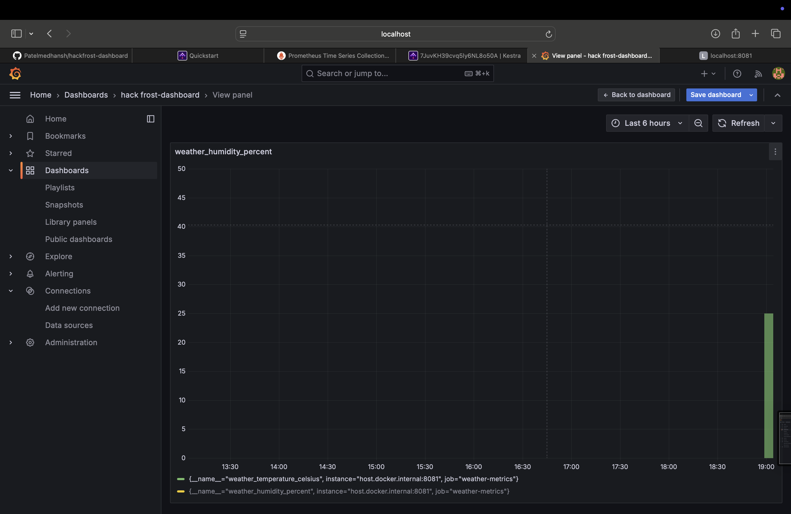
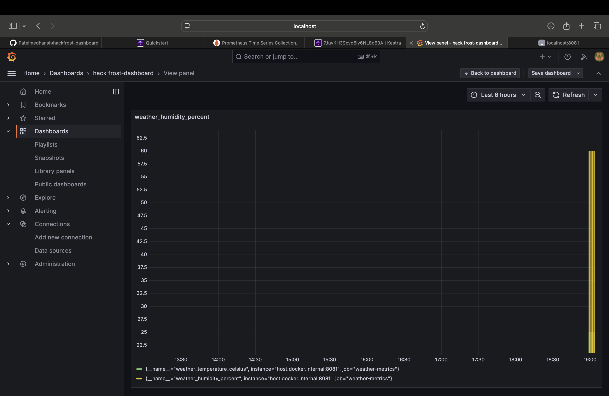
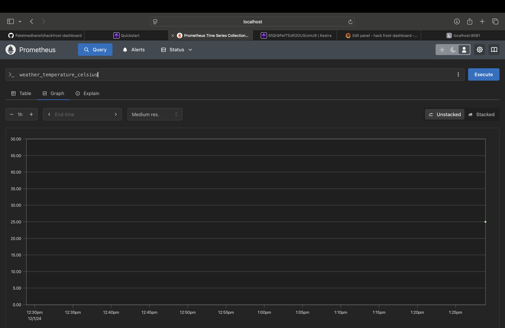
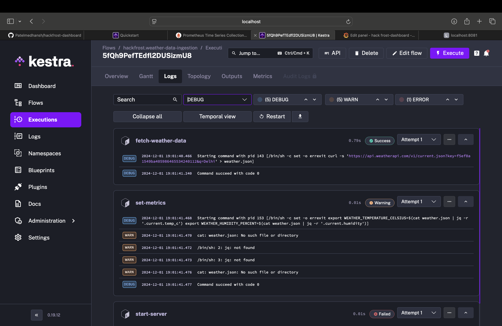
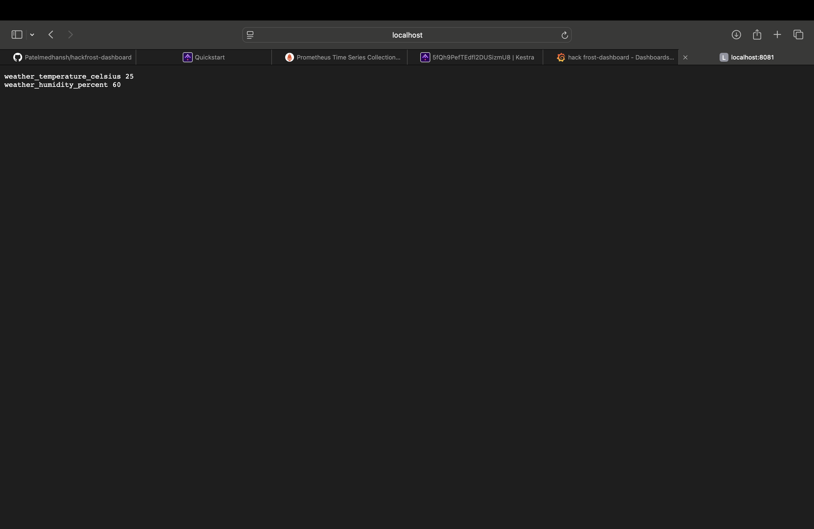

# hackfrost-dashboard
### **1. Creating a Professional README File**

Here’s the complete content for your `README.md` file to include in your GitHub repository:

---

#### **`README.md`**

```markdown
# Real-Time Weather Data Monitoring and Visualization Dashboard

## **Overview**

This project fetches live weather data, processes it into Prometheus-compatible metrics, and visualizes the data in Grafana dashboards. The system provides real-time insights into weather conditions such as temperature and humidity.

---

## **Features**

- Fetches real-time weather data from [WeatherAPI](https://www.weatherapi.com/).
- Exposes data as Prometheus metrics via a lightweight Python server.
- Visualizes metrics in Grafana dashboards.
- Fully containerized setup using Docker for Prometheus and Grafana.

---

## **Technologies Used**

- **Kestra**: Workflow orchestration for data fetching and processing.
- **Prometheus**: Metrics scraping and storage.
- **Grafana**: Visualization of real-time metrics.
- **Python**: Exposes Prometheus metrics via HTTP.
- **Docker**: Containerization of Prometheus and Grafana for easy deployment.

---

## **Architecture**

1. **Kestra** fetches live weather data and processes it into metrics.
2. **Python Server** exposes the processed metrics via HTTP for Prometheus to scrape.
3. **Prometheus** collects the metrics and makes them queryable.
4. **Grafana** visualizes the metrics in real-time on customizable dashboards.

---

## **Project Structure**

```
hackfrost-dashboard/
├── docker-compose.yml           # Docker Compose configuration for Prometheus and Grafana
├── prometheus.yml               # Prometheus configuration file
├── metrics_server.py            # Python server to expose metrics
├── kestra-workflows/
│   └── weather-ingestion.yml    # Kestra workflow definition
├── grafana/                     # Grafana persistent data
├── prometheus-data/             # Prometheus persistent data
└── README.md                    # Project documentation
```

---

## **Setup Instructions**

### **Prerequisites**

1. [Docker](https://www.docker.com/) and Docker Compose installed.
2. A valid WeatherAPI key. Obtain one from [WeatherAPI](https://www.weatherapi.com/).

### **Steps**

1. Clone this repository:
   ```bash
   git clone <repository-url>
   cd hackfrost-dashboard
   ```

2. Start Docker containers for Prometheus and Grafana:
   ```bash
   docker-compose up -d
   ```

3. Run the Python metrics server:
   ```bash
   python3 metrics_server.py
   ```

4. Access the following services:
   - **Prometheus**: [http://localhost:9090](http://localhost:9090)
   - **Grafana**: [http://localhost:3000](http://localhost:3000)
   - **Metrics Server**: [http://localhost:8081](http://localhost:8081)

5. Run the Kestra workflow:
   - Upload `kestra-workflows/weather-ingestion.yml` to the Kestra UI (`http://localhost:8080`).
   - Execute the workflow to fetch and process weather data.

6. Visualize the metrics in Grafana dashboards.

---

## **Usage**

- Query metrics in Prometheus:
  - `weather_temperature_celsius`
  - `weather_humidity_percent`
- Create Grafana panels for the above metrics to monitor weather data in real-time.

---


## Screenshots

### Grafana Dashboard
Here’s the Grafana dashboard visualizing real-time temperature and humidity metrics:




---

### Prometheus Query Results
Metrics like `weather_temperature_celsius` and `weather_humidity_percent` are scraped and stored in Prometheus:



---

### Kestra Workflow Execution
The workflow successfully fetches weather data and processes it for the metrics server:



---

### Python Server Output
The Python server exposes metrics on `localhost:8081`:



---

## **Future Enhancements**

1. Support for monitoring multiple cities.
2. Include additional weather parameters like wind speed and precipitation.
3. Add Grafana alerts for abnormal weather conditions.

---

## **License**

This project is licensed under the MIT License. See `LICENSE` for more details.

---

## **Acknowledgments**

- [WeatherAPI](https://www.weatherapi.com/) for providing weather data.
- [Prometheus](https://prometheus.io/) and [Grafana](https://grafana.com/) for monitoring and visualization tools.
- HackFrost organizers WeMakeDevs
```

---

